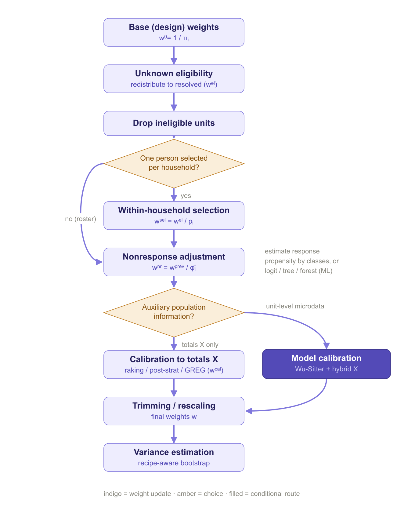

# weightflow 

> Declarative, pipeable survey weighting in base R — from design weights to
> calibrated, variance-ready weights.

**weightflow** builds survey weights by chaining hierarchical adjustments with a
`tidymodels`-style API, and estimates their variances with a bootstrap that
re-applies the whole recipe on each replicate. It has **no hard dependencies**
(base R, R >= 4.1) and bridges to `survey`/`srvyr` for design-based inference.

## How it works

weightflow expresses the whole weighting process as a sequence of explicit
steps. The diagram below summarizes the flow and the choices that depend on the
design and on the available auxiliary information.



 
## Installation

```r
# install.packages("remotes")
remotes::install_github("jpferreira33/weightflow")
```

## The idea

A recipe is **inert**: building it computes nothing. `prep()` walks the steps
*in order* and estimates the cascade of factors; `collect_weights()` extracts the
final weights. Separating *define* from *apply* makes the whole process
reproducible and auditable, and it is exactly what lets the bootstrap re-run the
entire cascade per replicate.

```r

library(weightflow)

recipe <- weighting_spec(sample_one, base_weights = pw) |>
  step_unknown_eligibility(unknown = unknown_elig, by = "region") |>
  step_drop_ineligible(ineligible = ineligible) |>
  step_nonresponse(respondent = hh_responded, method = "weighting_class",
                   by = "region") |>
  step_select_within(prob = p_within) |>
  step_nonresponse(respondent = responded, method = "propensity",
                   formula = ~ region + sex + age, engine = "logit",
                   num_classes = 10) |>
  step_calibrate(method = "raking",
                 margins = list(region = c(table(population$region)),
                                sex    = c(table(population$sex)))) |>
  step_trim_weights() |>
  step_assert(max_deff = 3)

fitted <- prep(recipe)              # estimate the cascade
summary(fitted)                     # per-stage diagnostics + Kish deff
wts    <- collect_weights(fitted)   # data.frame with .weight
```

## What it does

**Adjustment steps**, applied in the order you pipe them:

| Step | What it does |
|------|--------------|
| `step_unknown_eligibility()` | Redistribute unknown-eligibility cases among the known ones (person- or household-level via `cluster`). |
| `step_drop_ineligible()` | Zero out out-of-scope units. |
| `step_select_within()` | Within-household selection (unequal `prob` or equal `n_eligible`). |
| `step_nonresponse()` | Weighting classes or propensity (logit / CART / random forest), person- or household-level. |
| `step_calibrate()` | Raking, post-stratification, linear/GREG; bounded (Deville-Särndal) and integrative (one weight per household) options. |
| `step_model_calibration()` | Wu-Sitter model calibration with working models for the outcomes. |
| `step_trim()`, `step_trim_weights()` | Manual or automatic survey-style trimming, insertable anywhere. |
| `step_round()`, `step_rescale()` | Integer rounding and rescaling to a size or total. |
| `step_assert()` | Quality checkpoint on deff, weight ratio or effective n. |

Eligibility and response accept **0/1 dummy columns** or any logical condition.

**Diagnostics and reporting**: `summary()` and `plot()` show the per-stage
cascade with the **Kish design effect** (deff = 1 + CV²) and effective sample
size; `weight_factors()` returns the per-unit, per-step factors;
`report_weighting()` writes a self-contained HTML report — pipeline diagram,
variables used, per-stage summaries and per-step visuals — with no graphics
device or server required.

**Variance estimation** (see the *Variance estimation* article):

```r
boot <- bootstrap_weights(recipe, replicates = 500, strata = "region", psu = "psu")
boot_mean(boot, "income")           # estimate, SE and CI
as_svydesign(fitted, ids = "psu", strata = "region")   # survey linearization
collect_replicate_weights(boot)     # replicate weights, ready for srvyr
```

The bootstrap resamples PSUs within strata (Rao-Wu rescaling bootstrap) and
re-applies the recipe on each replicate, so the replicate weights carry the
variability of **every** adjustment.

## Example data

Three bundled datasets: `population` (the frame), `sample_survey` (take-all
roster) and `sample_one` (multistage select-one design), all with stratum, PSU
and design weight, so the full pipeline and the variance methods run natively.

## Extending

`apply_step()` is the internal S3 generic behind each step. To add an
adjustment, define a `step_*()` constructor (inert) and its
`apply_step.<class>()` method — nothing else changes.

## References

*General framework*

- Valliant, R., Dever, J. A., & Kreuter, F. (2018). *Practical Tools for Designing and Weighting Survey Samples* (2nd ed.). Springer.
- Särndal, C.-E., Swensson, B., & Wretman, J. (1992). *Model Assisted Survey Sampling*. Springer.

*Nonresponse*

- Särndal, C.-E., & Lundström, S. (2005). *Estimation in Surveys with Nonresponse*. Wiley.
- Little, R. J. A. (1986). Survey nonresponse adjustments for estimates of means. *International Statistical Review*, 54(2), 139–157.

*Calibration*

- Deville, J.-C., & Särndal, C.-E. (1992). Calibration estimators in survey sampling. *JASA*, 87(418), 376–382.
- Deville, J.-C., Särndal, C.-E., & Sautory, O. (1993). Generalized raking procedures in survey sampling. *JASA*, 88(423), 1013–1020.
- Deming, W. E., & Stephan, F. F. (1940). On a least squares adjustment of a sampled frequency table. *Annals of Mathematical Statistics*, 11(4), 427–444.
- Lemaître, G., & Dufour, J. (1987). An integrated method for weighting persons and families. *Survey Methodology*, 13(2), 199–207.
- Wu, C., & Sitter, R. R. (2001). A model-calibration approach to using complete auxiliary information from survey data. *JASA*, 96(453), 185–193.

*Design effect and trimming*

- Kish, L. (1965). *Survey Sampling*. Wiley. — and Kish, L. (1992). Weighting for unequal Pi. *Journal of Official Statistics*, 8(2), 183–200.
- Potter, F. J. (1990). A study of procedures to identify and trim extreme sample weights. *Proc. ASA Survey Research Methods Section*, 225–230.
- Potter, F., & Zheng, Y. (2015). Methods and issues in trimming extreme weights in sample surveys. *Proc. ASA Survey Research Methods Section*.

*Variance estimation*

- Rao, J. N. K., & Wu, C. F. J. (1988). Resampling inference with complex survey data. *JASA*, 83(401), 231–241.
- Rao, J. N. K., Wu, C. F. J., & Yue, K. (1992). Some recent work on resampling methods for complex surveys. *Survey Methodology*, 18(2), 209–217.
- Preston, J. (2009). Rescaled bootstrap for stratified multistage sampling. *Survey Methodology*, 35(2), 227–234.
- Wolter, K. M. (2007). *Introduction to Variance Estimation* (2nd ed.). Springer.
- Lumley, T. (2010). *Complex Surveys: A Guide to Analysis Using R*. Wiley.

## License

MIT © Juan Pablo Ferreira
