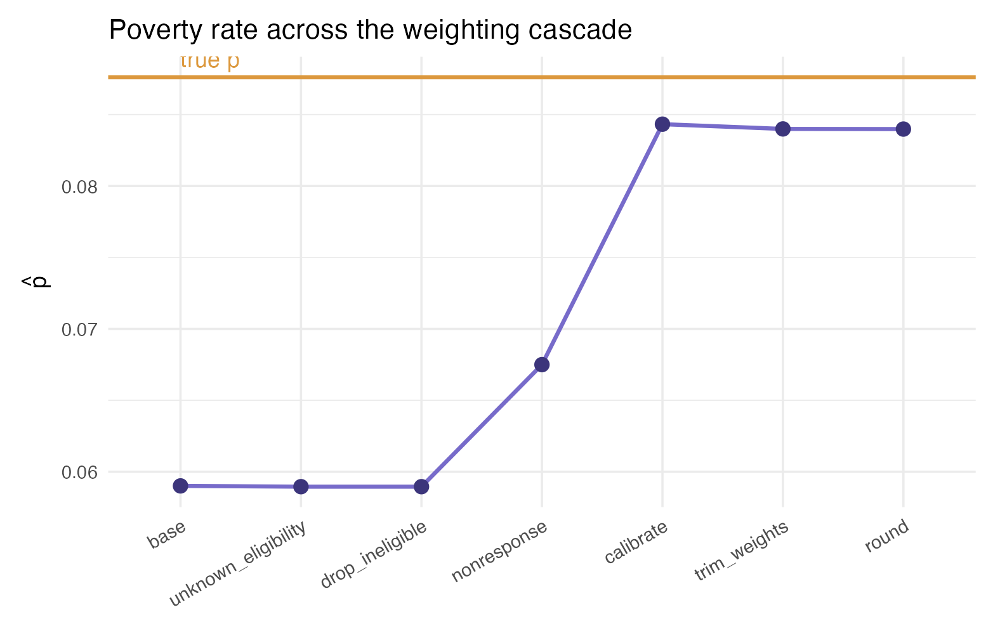
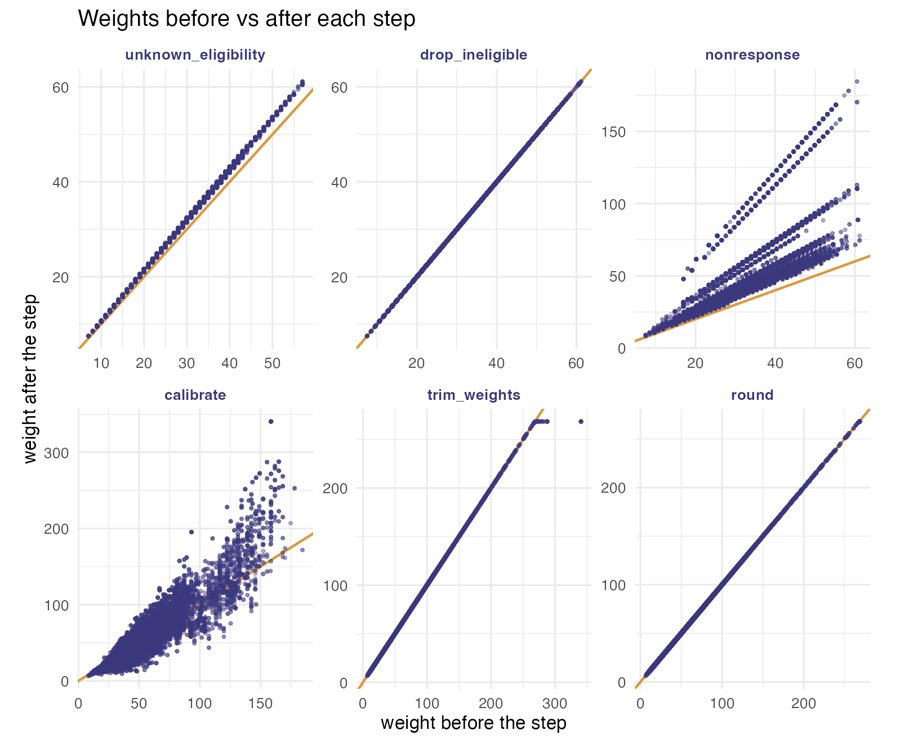

# A full weighting pipeline on a real household survey (ECH 2019)

This article puts the whole `weightflow` pipeline to work on a real
survey: the Uruguayan continuous household survey (Encuesta Continua de
Hogares, ECH 2019), released as open microdata by the national
statistical office (INE). It doubles as a stress test, since the working
sample has tens of thousands of records and the expanded population has
more than three million.

The published microdata contain only the eligible respondents. A real
survey operation also faces ineligible units, units of unknown
eligibility, and nonresponse, and none of those carry survey answers. To
exercise the full pipeline we induce these outcomes on the public data
in a reproducible (seeded) way, weight the survivors back to the
population, and check how close we land to a known truth.

The target parameter is the **poverty rate**
``` math
p = \frac{1}{N}\sum_{i \in U} y_i,
```
where $`y_i = 1`$ if person $`i`$ is poor and $`U`$ is the population.
The estimator is the weighted mean
$`\hat p = \sum_s w_i\,y_i / \sum_s w_i`$, and the weights travel
through the cascade
$`w_i^0 \to w_i^{el} \to w_i^{nr} \to w_i^{cal} \to w_i`$: design base
weight, unknown-eligibility adjustment, nonresponse adjustment,
calibration, and final trimming and rounding.

The code below is shown but not executed when this page is built,
because the data download reaches the INE portal, which is not available
from the build servers. The figures and tables are those produced by
running the code locally.

``` r

library(weightflow)
library(dplyr)
library(tidyr)
library(haven)
library(archive)
library(ggplot2)

wf_violet <- "#3d3580"; wf_lav <- "#7a6ad0"; wf_amber <- "#e8941f"
```

## 1. Download the ECH microdata

The INE publishes, on its ANDA portal, the ECH 2019 person/household
file and a companion file with the stratum and primary sampling unit
(PSU) of each household. We download both and unpack them.

``` r

dir_ine <- "ech_data"
if (!dir.exists(dir_ine)) dir.create(dir_ine)

f1 <- tempfile(fileext = ".rar")
download.file("https://www4.ine.gub.uy/Anda5/index.php/catalog/715/download/956",
              f1, mode = "wb"); archive_extract(f1, dir = dir_ine)

f2 <- tempfile(fileext = ".rar")
download.file("https://www4.ine.gub.uy/Anda5/index.php/catalog/715/download/1154",
              f2, mode = "wb"); archive_extract(f2, dir = dir_ine)
```

## 2. Build the sample and the population

We keep the design identifiers (stratum, PSU, household), the
calibration auxiliaries (region, sex, age), the outcome (poverty), and
the ECH person weight. Each row is a person, and the design is
two-stage: PSUs within strata, with the household as the last stage.

A key modelling choice: we set the base weight equal to the **individual
ECH weight** `w_ech`. With this choice the base-weighted poverty rate
reproduces the population rate exactly, so the sample starts at the
truth and any later gap is caused by the problems we induce, not by the
starting point. Expanding the sample by `w_ech` gives the finite
population `U`, the ground truth.

``` r

df_raw <- read_sav(file.path(dir_ine, "HyP_2019_Terceros.sav"))
info   <- read_sav(file.path(dir_ine, "ESTRATO_UPM_ECH2019.sav"))

df <- df_raw |>
  left_join(info |> select(numero, estrato, upm_fic), by = "numero") |>
  transmute(
    id_household  = numero,
    person_number = nper,
    strata        = estrato,
    psu           = upm_fic,
    region        = as_factor(dpto),
    sex           = ifelse(e26 == 1, "male", "female"),
    age           = e27,
    poverty       = ifelse(pobre06 == 1, 1, 0),
    w_ech         = pesoano
  ) |>
  mutate(base_weight = w_ech)

brks <- seq(0, 100, by = 5)
df   <- df |> mutate(age_grp = cut(age, breaks = brks, right = FALSE))

sample_ech_full <- df |> select(-w_ech)
U      <- df |> uncount(w_ech)
p_true <- mean(U$poverty)            # 0.08761
```

## 3. Induce eligibility and response outcomes

Because the public file is all eligible respondents, we induce the
operational outcomes at the **household** level: a dwelling is
ineligible, of unknown eligibility, or a nonrespondent as a whole. Frame
variables (region, stratum, PSU, base weight) stay known for every
household. The survey variables (sex, age, poverty) are erased for
problematic households, which collapse to a single row, because in
practice their roster is never observed.

Nonresponse is missing-at-random and coherent with reality: the poorest
strata (the low-numbered ones) respond less, and younger households
respond less too. Since poverty is concentrated in the low strata and
among the young, this makes the poor under-represented among
respondents, the direction a real survey faces. The stratum part is
recoverable by the class adjustment; the age part is left for
calibration to recover through the age margins.

``` r

set.seed(2023)

hh <- sample_ech_full |>
  group_by(id_household) |>
  summarise(strata = first(strata), psu = first(psu), region = first(region),
            base_weight = first(base_weight), mean_age = mean(age),
            .groups = "drop")

u <- runif(nrow(hh))
hh$ineligible   <- as.integer(u < 0.04)
hh$unknown_elig <- as.integer(u >= 0.04 & u < 0.10)
hh$eligible     <- as.integer(u >= 0.10)

sn <- suppressWarnings(as.numeric(as.character(hh$strata)))
strata_logit <- ifelse(sn <= 2, -0.8,
                ifelse(sn <= 5,  0.0,
                ifelse(sn <= 10, 0.9, 1.5)))
strata_logit[is.na(strata_logit)] <- 0.9
p_resp <- plogis(strata_logit + 0.040 * (hh$mean_age - 40))

hh$responded <- 0L
elig <- hh$eligible == 1
hh$responded[elig] <- rbinom(sum(elig), 1, p_resp[elig])

resp_hh <- hh$id_household[hh$responded == 1 & hh$eligible == 1]
persons_resp <- sample_ech_full |>
  filter(id_household %in% resp_hh) |>
  left_join(hh |> select(id_household, ineligible, unknown_elig, responded),
            by = "id_household") |>
  select(id_household, person_number, strata, psu, region, base_weight,
         sex, age, age_grp, poverty, ineligible, unknown_elig, responded)
prob_hh <- hh |>
  filter(!(responded == 1 & eligible == 1)) |>
  transmute(id_household, person_number = 1L, strata, psu, region, base_weight,
            sex = NA_character_, age = NA_real_,
            age_grp = factor(NA, levels = levels(df$age_grp)),
            poverty = NA_real_, ineligible, unknown_elig, responded)

sample_ech <- bind_rows(persons_resp, prob_hh) |>
  arrange(id_household, person_number)
```

## 4. Build calibration targets from the population

Calibration needs population totals for the margins. A statistical
office reads these from population projections; here we read them from
`U`. We calibrate to the number of people by five-year age group, by
sex, and by region, building the totals with the same model matrix the
recipe will use. After dropping the ineligibles the sample represents
the eligible population, which is smaller than all of `U`; since
eligibility was induced at random, we scale the totals by the eligible
share.

``` r

elig_factor <- mean(hh$eligible)
cal_formula <- ~ age_grp + sex + region
XU     <- model.matrix(cal_formula, data = U)
totals <- colSums(XU) * elig_factor
```

## 5. The weighting recipe

We pipe the whole cascade. The eligibility and nonresponse adjustments
use `cluster = "id_household"`, so they act at the dwelling level,
matching how the outcomes were induced. The calibration step uses
**linear** distance with `equal_within_cluster = TRUE`, which produces a
single weight per household (integrated household weighting,
Lemaitre-Dufour), as an official household survey requires.

``` r

fitted <- weighting_spec(sample_ech, base_weights = base_weight) |>
  step_unknown_eligibility(unknown = unknown_elig == 1, by = "region",
                           cluster = "id_household") |>
  step_drop_ineligible(ineligible = ineligible == 1) |>
  step_nonresponse(respondent = responded, method = "weighting_class",
                   by = "strata", cluster = "id_household") |>
  step_calibrate(method = "linear", formula = cal_formula, totals = totals,
                 cluster = "id_household", equal_within_cluster = TRUE) |>
  step_trim_weights(method = "potter") |>
  step_round(digits = 0, method = "preserve_total") |>
  prep()

summary(fitted)
```

The stage summary reports, for each step, the number of active units,
the sum of weights, the coefficient of variation of the weights, the
Kish design effect and the effective sample size.

| stage               | n_active | sum_wts | cv_wts | deff_kish | n_eff |
|---------------------|---------:|--------:|-------:|----------:|------:|
| base                |    79178 | 2467595 |  0.279 |     1.078 | 73456 |
| unknown_eligibility |    76624 | 2546261 |  0.278 |     1.077 | 71141 |
| drop_ineligible     |    74991 | 2495751 |  0.277 |     1.076 | 69665 |
| nonresponse         |    63423 | 3144040 |  0.481 |     1.231 | 51502 |
| calibrate           |    63423 | 3171410 |  0.650 |     1.423 | 44573 |
| trim_weights        |    63423 | 3171410 |  0.647 |     1.419 | 44703 |
| round               |    63423 | 3171410 |  0.647 |     1.419 | 44703 |

The design effect rises with the nonresponse and calibration steps
(unequal weighting costs precision) and is held back slightly by
trimming.

## 6. The estimate against the truth

We compute $`\hat p`$ at each stage of the cascade and compare it with
the true rate $`p = 0.08761`$. The naive (base-weight) estimate is
biased downward, because the poor responded less. The nonresponse
adjustment by stratum recovers the between-strata part of that bias, and
calibration to age, sex and region recovers the rest.

``` r

y <- sample_ech$poverty
stage_phat <- sapply(fitted$history, function(w) {
  ok <- w > 0 & !is.na(y); sum(w[ok] * y[ok]) / sum(w[ok])
})
labs <- gsub("^stage_[0-9]+_step_", "", names(stage_phat))
est  <- data.frame(stage = factor(labs, levels = labs), phat = stage_phat)

ggplot(est, aes(stage, phat, group = 1)) +
  geom_hline(yintercept = p_true, color = wf_amber, linewidth = 1) +
  annotate("text", x = levels(est$stage)[1], y = p_true, label = "true p",
           vjust = -0.6, hjust = 0, color = wf_amber) +
  geom_line(color = wf_lav, linewidth = 1) +
  geom_point(color = wf_violet, size = 3) +
  labs(x = NULL, y = expression(hat(p)),
       title = "Poverty rate across the weighting cascade") +
  theme_minimal(base_size = 12) +
  theme(axis.text.x = element_text(angle = 30, hjust = 1))
```

| stage               | $`\hat p`$ | distance to $`p`$ |
|---------------------|-----------:|------------------:|
| base                |    0.05901 |          -0.02860 |
| unknown_eligibility |    0.05896 |          -0.02865 |
| drop_ineligible     |    0.05896 |          -0.02865 |
| nonresponse         |    0.06750 |          -0.02011 |
| calibrate           |    0.08433 |          -0.00328 |
| trim_weights        |    0.08399 |          -0.00362 |
| round               |    0.08398 |          -0.00363 |



Poverty rate across the weighting cascade

Each adjustment moves the estimate toward the truth: the nonresponse
step lifts it from the badly biased base, and calibration brings it
close to $`p`$. A small residual gap remains, which is honest and
expected, since the adjustments use only the frame and the calibration
margins.

## 7. Per-step weight diagnostics

We inspect what each step does to the weights. First, a scatter of the
weight before versus after each step: points on the amber diagonal were
left untouched, points off it were reweighted. The integrated household
calibration shows up as aligned points, because every member of a
household receives the same factor.

``` r

h    <- fitted$history
labs <- gsub("^stage_[0-9]+_step_", "", names(h))

pairs <- bind_rows(lapply(seq_len(length(h) - 1L), function(i) {
  prev <- h[[i]]; cur <- h[[i + 1L]]; keep <- prev > 0 & cur > 0
  data.frame(step = factor(labs[i + 1L], levels = labs[-1]),
             prev = prev[keep], cur = cur[keep])
}))

ggplot(pairs, aes(prev, cur)) +
  geom_abline(slope = 1, intercept = 0, color = wf_amber, linewidth = 0.7) +
  geom_point(color = wf_violet, alpha = 0.2, size = 0.6) +
  facet_wrap(~ step, scales = "free", ncol = 3) +
  labs(x = "weight before the step", y = "weight after the step",
       title = "Weights before vs after each step") +
  theme_minimal(base_size = 11) +
  theme(strip.text = element_text(color = wf_violet, face = "bold"))
```



Weights before vs after each step

Second, the distribution of the adjustment factor (the weight after the
step divided by the weight before). A factor of one (the amber line)
means the step left a unit untouched; mass away from one shows where,
and how hard, the step worked.

``` r

ggplot(pairs |> mutate(factor = cur / prev), aes(factor)) +
  geom_histogram(bins = 30, fill = wf_lav, color = "white") +
  geom_vline(xintercept = 1, color = wf_amber, linewidth = 0.7) +
  facet_wrap(~ step, scales = "free", ncol = 3) +
  labs(x = "adjustment factor (after / before)", y = "units",
       title = "Distribution of the adjustment factor at each step") +
  theme_minimal(base_size = 11) +
  theme(strip.text = element_text(color = wf_violet, face = "bold"))
```


Distribution of the adjustment factor at each step

The Kish design effect summarises the variance cost of unequal weights
at each stage.

``` r

data.frame(
  stage = labs,
  deff  = round(vapply(h, function(w) design_effect(w)$deff, numeric(1)), 3)
)
```

| stage               |  deff |
|---------------------|------:|
| base                | 1.078 |
| unknown_eligibility | 1.077 |
| drop_ineligible     | 1.076 |
| nonresponse         | 1.231 |
| calibrate           | 1.423 |
| trim_weights        | 1.419 |
| round               | 1.419 |

## 8. Design-based inference: bootstrap and 95% CI

The variance must reflect the design (PSUs within strata) and the fact
that the recipe is re-estimated on each replicate.
[`bootstrap_weights()`](https://jpferreira33.github.io/weightflow/reference/bootstrap_weights.md)
resamples PSUs within strata (Rao-Wu rescaling) and re-applies the whole
recipe;
[`boot_mean()`](https://jpferreira33.github.io/weightflow/reference/bootstrap_estimate.md)
returns the estimate, its standard error and a 95% interval (a normal
interval around the point estimate).

``` r

boot <- bootstrap_weights(fitted, replicates = 1000, strata = "strata", psu = "psu")
ci <- boot_mean(boot, "poverty")
ci
```

The empirical distribution of $`\hat p`$ across the replicates shows the
sampling variability behind that interval. The 95% interval covers the
true poverty rate (the amber line), so the design-based inference works:
the pipeline recovers the population poverty rate with honest
uncertainty.

``` r

reps <- apply(boot$replicates, 2, function(w) {
  ok <- w > 0 & !is.na(y); sum(w[ok] * y[ok]) / sum(w[ok])
})

ggplot(data.frame(phat = reps), aes(phat)) +
  geom_histogram(bins = 30, fill = wf_lav, color = "white") +
  geom_vline(xintercept = ci$estimate, color = wf_violet, linewidth = 1) +
  geom_vline(xintercept = c(ci$ci_lower, ci$ci_upper), color = wf_violet,
             linetype = "dashed") +
  geom_vline(xintercept = p_true, color = wf_amber, linewidth = 1) +
  annotate("text", x = p_true, y = Inf, label = "true p", vjust = 1.4,
           hjust = -0.1, color = wf_amber) +
  labs(x = expression(hat(p)), y = "replicates",
       title = "Bootstrap distribution of the poverty-rate estimator",
       subtitle = "solid = estimate, dashed = 95% CI, amber = true p") +
  theme_minimal(base_size = 12)
```


Bootstrap distribution of the poverty-rate estimator

## Performance

This also serves as a light stress test. On a MacBook Air (Apple M4, 16
GB RAM, macOS 26.3), running R, the full recipe on about 79,000 records
(eligibility, nonresponse, integrated household calibration, trimming
and rounding) takes well under a second:

    #> Recipe (prep) elapsed: 0.45 seconds

The bootstrap is the heavy part, because it resamples PSUs within strata
and **re-applies the entire recipe** on each of the 1000 replicates:

    #> Bootstrap (1000 replicates) elapsed: 343.59 seconds

So the point estimate and all its diagnostics are essentially instant,
and full design-based inference with a thousand replicates takes a few
minutes on a laptop.

## Notes

Everything is reproducible from the public ECH file plus the seeded
code, so the induced outcomes and the resulting weights are identical on
every run. The residual gap between the final estimate and the truth is
a faithful reminder that weighting reduces nonresponse bias
substantially but, when the response mechanism depends on more than the
frame and the calibration margins, does not erase it entirely.
