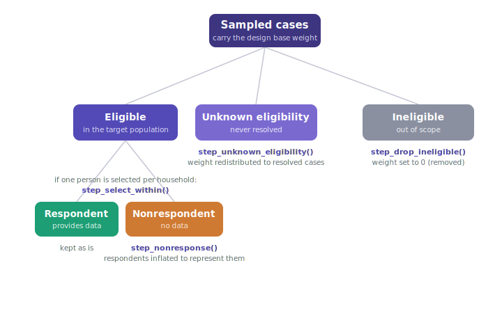

```{r setup, include = FALSE}
knitr::opts_chunk$set(collapse = TRUE, comment = "#>")
library(weightflow)
```

Weighting starts before any factor is computed: with a clean classification of
**what each sampled case is**. Every record drawn from the frame has to be placed
in one of a few mutually exclusive dispositions, because each disposition is
handled by a different weighting adjustment (and some are not weighted at all).
Getting this classification right, and encoding it in the right columns, is what
makes the rest of the cascade correct. This article shows the standard
disposition tree, explains when each branch arises in practice, lists the columns
`weightflow` expects, and runs a full pipeline on the bundled multistage sample.

The framework follows the survey-methodology standard: the eligibility and
response outcomes of Valliant, Dever and Kreuter (2018) and the final-disposition
categories of the AAPOR *Standard Definitions* (2016).

## The disposition tree

Every sampled case is first resolved for **eligibility** (does it belong to the
target population?) and only eligible cases are then resolved for **response**.
The colours below are reused throughout `weightflow`'s plots and reports.

```{r tree, echo=FALSE, out.width="100%", fig.alt="Survey disposition tree: sampled cases split into eligible, unknown eligibility and ineligible; eligible cases split into respondents and nonrespondents."}

```

## What each branch means, and when it happens

**Ineligible (out of scope).** Resolved cases that do not belong to the target
population: a business or fax number in a survey of households, a vacant or
demolished dwelling, an address outside the geographic scope, a person outside
the age range. They are known with certainty not to be part of $U$, so they get
weight zero. Crucially they are *kept* in the data until after the unknown
adjustment, so they can absorb their share of the unresolved cases first (see the
ordering below).

**Unknown eligibility (unresolved).** Cases you cannot classify as eligible or
ineligible. Two situations feed this branch, and both belong here:

- *No evidence of eligibility.* The case was worked but never resolved: a phone
  that never answers, a questionnaire returned undelivered, an address where no
  contact was ever made and no roster obtained.
- *Released but not worked.* Sample that was fielded but never attempted, because
  the target number of interviews was already reached, globally or for a specific
  domain (a region, an age group, a quota that closed early). There was no chance
  to observe whether these cases are in scope, so they too are of unknown
  eligibility. AAPOR treats released sample that is not worked as unknown
  eligibility; only sample that was never *released* is excluded from the base
  altogether.

Discarding the unknowns assumes they represent nobody; treating them all as
eligible overstates the population. The standard fix redistributes their weight
to the resolved cases within adjustment cells, so the resolved units stand in for
the unresolved share. The implicit assumption is that the eligible fraction among
the unknowns matches that of the resolved cases in the cell (the "e" factor in
AAPOR response-rate formulas).

**Eligible.** In scope and resolved. These split into respondents and
nonrespondents.

**Respondent.** Provided usable data. The survey outcomes ($y$) are observed only
here. Respondents are kept and later inflated to also represent the
nonrespondents.

**Nonrespondent.** Eligible but no usable data: refusal, noncontact after
eligibility was established, break-off. Under the assumption that response is
ignorable given the auxiliaries used, respondents are inflated to cover them
(`step_nonresponse()`, by weighting classes or a response-propensity model).

In a multistage household design the response branch happens twice: first at the
household level (was the household reached and a roster obtained?), then at the
person level (did the selected person respond?). Between them sits
`step_select_within()`, which restores the within-household selection
probabilities when a subsample of persons is chosen.

## Why there is unused and out-of-scope sample: sizing the design

These dispositions are not accidents; they are anticipated when the sample is
sized. You never field only the number of interviews you want, because not every
released case will be eligible and not every eligible case will respond. Starting
from a target number of completed interviews $n_C$, the released sample is
inflated by the expected eligibility and response rates, plus a contingency
cushion for a worse-than-expected field:

$$
n_{\text{released}} \;=\; \frac{n_C}{\widehat{E}\times\widehat{R}}\;(1+c),
$$

where $\widehat{E}$ is the expected eligibility rate, $\widehat{R}$ the expected
response rate, and $c$ a cushion (a design margin for the pessimistic scenario,
and to protect the sample sizes needed for each domain or breakdown). Valliant,
Dever and Kreuter (2018) develop this sizing in detail.

Two consequences show up in the delivered dataset. Because $\widehat{E}<1$, part
of the released sample turns out **ineligible**. Because the cushion and the
per-domain targets are deliberately generous, some released sample ends up **not
worked** once the targets are met, and that portion is **unknown eligibility**.
Both are expected products of the design, and both must be represented in the
data so the weighting can account for them, rather than silently dropped.

## What your input data needs

The starting point is a **disposition column**: the field outcome (the "causal")
recorded for every case in the theoretical sample. This is where the AAPOR final
disposition of each unit lives (complete, refusal, noncontact, ineligible,
undelivered, not worked, and so on). Every case in the released sample must have
one, including the ineligible, the unresolved and the not-worked cases; they are
part of the sample and cannot be missing rows. From that single column you derive
the 0/1 flags each step reads.

`weightflow` never guesses dispositions; you encode them as columns and point
each step at the relevant one. For the disposition stages the recipe expects:

| Disposition column | Type | Used by |
|---|---|---|
| disposition / reason | code or factor (source of the flags) | you, to build the flags below |
| design base weight | numeric, > 0 | `weighting_spec(base_weights = )` |
| unknown eligibility | 0/1 flag (1 = unresolved or not worked) | `step_unknown_eligibility(unknown = )` |
| ineligible | 0/1 flag (1 = out of scope) | `step_drop_ineligible(ineligible = )` |
| within-household prob. | numeric in (0, 1] | `step_select_within(prob = )` |
| respondent | 0/1 flag (1 = responded) | `step_nonresponse(respondent = )` |

Deriving the flags from the disposition code is a direct recode, for example:

```{r recode, eval = FALSE}
dat$unknown_elig <- as.integer(dat$disposition %in%
                                 c("noncontact", "undelivered", "not_worked"))
dat$ineligible   <- as.integer(dat$disposition %in%
                                 c("out_of_scope", "vacant", "business"))
dat$responded    <- as.integer(dat$disposition == "complete")
```

Two conventions matter. First, the flags are 0/1 indicators (or an unquoted
logical condition), so a case that is neither unknown nor ineligible is treated
as resolved and eligible. Second, the survey outcomes are `NA` for
nonrespondents; that is expected, because the nonresponse step drops them from
the active set before any outcome is used.

Adjustment cells (`by = `) and, for roster-less cases, the household id
(`cluster = `) are the other inputs: the unknown and nonresponse adjustments are
computed within these cells.

## Order of operations

The sequence is not interchangeable, and it follows directly from the tree:

1. **Unknown eligibility first**, while ineligibles are still present, so the
   unresolved weight is spread over *all* resolved cases (eligible and
   ineligible), not only the eligible ones. Redistributing only to eligibles
   would overstate the population.
2. **Drop ineligibles next**: once they have absorbed their share of the
   unresolved weight, the out-of-scope units are removed (weight zero).
3. **Within-household selection**, to undo the subsampling of persons.
4. **Nonresponse last**, inflating respondents to represent nonrespondents among
   the eligible, resolved cases.
5. Calibration then aligns the eligible respondents with external population
   totals (covered in the calibration articles).

## A full pipeline on the multistage sample

`sample_one` is a multistage select-one design that carries every disposition:
unknown-eligibility and ineligible addresses arrive as single rows with no
roster; resolved eligible households are either reached or are household
nonresponse; in reached households one person is selected and may or may not
respond.

```{r dispositions}
dat <- sample_one

# the whole field disposition in a single column, matching the tree above
table(disposition = dat$disposition)
```

`sample_one` ships the dispositions in two equivalent forms: the ready-made 0/1
indicator columns (`unknown_elig`, `ineligible`, `responded`, `hh_responded`) and
the single `disposition` factor they were recoded from. Every step accepts either
a 0/1 column or an unquoted logical condition, so you can point a step at the
indicator column or write the condition on `disposition` directly; the two give
the same flag.

```{r two-styles}
# the indicator column and the equivalent condition on `disposition` agree
identical(dat$ineligible == 1L, dat$disposition == "ineligible")

# so these two calls are interchangeable:
#   step_drop_ineligible(ineligible = ineligible)
#   step_drop_ineligible(ineligible = disposition == "ineligible")
```

We add an age grouping for the person-level nonresponse cells, then run the
disposition stages in order (using the indicator columns here).

```{r pipeline}
dat$age_grp <- cut(dat$age, c(0, 30, 45, 60, Inf),
                   labels = c("18-30", "31-45", "46-60", "60+"))

fitted <- weighting_spec(dat, base_weights = pw) |>
  # 1. unresolved cases: redistribute their weight within region (no roster)
  step_unknown_eligibility(unknown = unknown_elig, by = "region") |>
  # 2. out-of-scope cases: remove after they absorbed the unknown share
  step_drop_ineligible(ineligible = ineligible) |>
  # 3. household nonresponse: reached vs not, within region
  step_nonresponse(respondent = hh_responded, method = "weighting_class",
                   by = "region") |>
  # 4. within-household selection of one person
  step_select_within(prob = p_within) |>
  # 5. person nonresponse, within demographic cells
  step_nonresponse(respondent = responded, method = "weighting_class",
                   by = c("region", "sex", "age_grp")) |>
  prep()

fitted
```

The stage summary shows how the active sample and the weight total change as each
disposition is handled: unresolved weight is moved onto resolved cases,
ineligibles drop out, and respondents are inflated to carry the nonrespondents.

```{r summary}
summary(fitted)
```

From here the recipe would continue with calibration and, optionally, trimming;
those stages are covered in the calibration and getting-started articles. The
point of this article is upstream of them: if the dispositions are classified and
encoded correctly, every later factor is applied to the right set of cases.

## References

Valliant, R., Dever, J. A., & Kreuter, F. (2018). *Practical Tools for Designing
and Weighting Survey Samples* (2nd ed.). Springer. Chapters on nonresponse and
unknown-eligibility adjustments and weighting classes.

The American Association for Public Opinion Research (2016). *Standard
Definitions: Final Dispositions of Case Codes and Outcome Rates for Surveys* (9th
ed.). AAPOR. Definitions of eligible, ineligible and unknown-eligibility cases,
and the treatment of released-but-not-worked sample as unknown eligibility.

Kish, L. (1965). *Survey Sampling.* Wiley. Within-household selection and the
design effect of unequal weights.

Särndal, C.-E., Swensson, B., & Wretman, J. (1992). *Model Assisted Survey
Sampling.* Springer. Design-based nonresponse and calibration adjustments.
